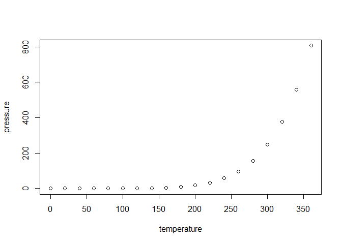

p8105_hw1_al4922.Rmd
================
2026-09-23

## R Markdown

This is an R Markdown document. Markdown is a simple formatting syntax
for authoring HTML, PDF, and MS Word documents. For more details on
using R Markdown see <http://rmarkdown.rstudio.com>.

When you click the **Knit** button a document will be generated that
includes both content as well as the output of any embedded R code
chunks within the document. You can embed an R code chunk like this:

``` r
summary(cars)
```

    ##      speed           dist       
    ##  Min.   : 4.0   Min.   :  2.00  
    ##  1st Qu.:12.0   1st Qu.: 26.00  
    ##  Median :15.0   Median : 36.00  
    ##  Mean   :15.4   Mean   : 42.98  
    ##  3rd Qu.:19.0   3rd Qu.: 56.00  
    ##  Max.   :25.0   Max.   :120.00

## Including Plots

You can also embed plots, for example:

<!-- -->

Note that the `echo = FALSE` parameter was added to the code chunk to
prevent printing of the R code that generated the plot.

## Problem 1

``` r
data("penguins", package = "palmerpenguins") #load penguins dataset
summary(penguins) #gives species and mean flipper length
```

    ##       species          island    bill_length_mm  bill_depth_mm  
    ##  Adelie   :152   Biscoe   :168   Min.   :32.10   Min.   :13.10  
    ##  Chinstrap: 68   Dream    :124   1st Qu.:39.23   1st Qu.:15.60  
    ##  Gentoo   :124   Torgersen: 52   Median :44.45   Median :17.30  
    ##                                  Mean   :43.92   Mean   :17.15  
    ##                                  3rd Qu.:48.50   3rd Qu.:18.70  
    ##                                  Max.   :59.60   Max.   :21.50  
    ##                                  NAs    :2       NAs    :2      
    ##  flipper_length_mm  body_mass_g       sex           year     
    ##  Min.   :172.0     Min.   :2700   female:165   Min.   :2007  
    ##  1st Qu.:190.0     1st Qu.:3550   male  :168   1st Qu.:2007  
    ##  Median :197.0     Median :4050   NAs   : 11   Median :2008  
    ##  Mean   :200.9     Mean   :4202                Mean   :2008  
    ##  3rd Qu.:213.0     3rd Qu.:4750                3rd Qu.:2009  
    ##  Max.   :231.0     Max.   :6300                Max.   :2009  
    ##  NAs    :2         NAs    :2

``` r
nrow(penguins) #gives number of penguins
```

    ## [1] 344

``` r
ncol(penguins) #gives number of variables 
```

    ## [1] 8

## Penguins Dataset Description

The penguins dataset describes the various characteristics (habitat and
various physical characteristics) of three species of penguins Adelie,
Chinstrap and Gentoo. Its key variables are: species, island, bill
lengths and depth, body mass, flipper length, year and sex. The data
includes 344 individuals and 8 distinct variables and the mean flipper
length of the penguins is 200.9 mm.

    ## Warning: Removed 2 rows containing missing values or values outside the scale range
    ## (`geom_point()`).

<!-- -->

``` r
ggsave("flippervbill.png",
       plot = penguin_scatterplot,) #exported plot to directory
```

    ## Saving 7 x 5 in image

    ## Warning: Removed 2 rows containing missing values or values outside the scale range
    ## (`geom_point()`).

## Problem 2

``` r
set.seed(367) 
##This makes it so that the numbers are reproducible
```

``` r
norm_sample <- rnorm(10)
##This generates a group with 10 samples form a standard Normal distribution
```

``` r
Q2_df <- data.frame(
  norm_vec = norm_sample,
  log_vec = norm_sample > 0,
  char_vec = letters[1:10], #Generates "a" through "j"
  factor_vec = factor(c("low", "med", "high", "low", "med", "high", "low", "med", "high", "low"))
)
##This generates the data frame 
```

``` r
# 1. Numeric variable (Works)
Q2_df %>% 
  pull(norm_vec) %>% 
  mean()
```

    ## [1] -0.3317448

``` r
# 2. Logical variable (Works - returns proportion of TRUEs)
Q2_df %>% 
  pull(log_vec) %>% 
  mean()
```

    ## [1] 0.4

``` r
# 3. Character variable (Returns NA with warning)
Q2_df %>% 
  pull(char_vec) %>% 
  mean()
```

    ## Warning in mean.default(.): argument is not numeric or logical: returning NA

    ## [1] NA

``` r
# 4. Factor variable (Returns NA with warning)
Q2_df %>% 
  pull(factor_vec) %>% 
  mean()
```

    ## Warning in mean.default(.): argument is not numeric or logical: returning NA

    ## [1] NA

Question: Why use pull function when we can use dollar sign?

``` r
# Convert logical to numeric
as.numeric(Q2_df$log_vec)
```

    ##  [1] 0 1 1 1 0 1 0 0 0 0

``` r
# Convert character to numeric
as.numeric(Q2_df$char_vec)
```

    ## Warning: NAs introduced by coercion

    ##  [1] NA NA NA NA NA NA NA NA NA NA

``` r
# Convert factor to numeric
as.numeric(Q2_df$factor_vec)
```

    ##  [1] 2 3 1 2 3 1 2 3 1 2

### What Happens and Why

1.  Logical (‘log_vec’): The logical vectors were successfully converted
    into ‘1’s and ’0’s because in R, boolean is stored in binary
    representation and so translating from ’TRUE’/‘FALSE’ and ‘1’/‘0’
    works.

2.  Character (‘char_vec’): Each string was converted into NA because
    there’s no “quantity” assigned to different ‘words’ or ‘strings’. R
    can’t do this conversion.

3.  Factor (‘factor_vec’): The factor levels were converted into three
    corresponding numbers (ie. ‘1’, ‘2’, ‘3’) because R stores factor
    variables as integer vectors in the background. What ‘as.numeric()’
    does is that it takes the text labels ‘off’ exposing the numeric
    codes.

Does this explain what happens when we try to take means?

1.  **Logical variables work directly with `mean()`** because `mean()`
    performs implicit coercion. Behind the scenes, it converts `TRUE`
    $\rightarrow$ `1` and `FALSE` $\rightarrow$ `0`. The sum of those
    values divided by $N$ equals the exact proportion of `TRUE` entries.
2.  **Character variables fail with `mean()`** because implicit coercion
    encounters non-numeric text and generates `NA`s, triggering the
    error/warning.
3.  **Factor variables reveal why R has protective guards.** While
    `as.numeric()` *can* turn a factor into numbers (1, 2, 3), `mean()`
    strictly refuses to do so automatically. `mean()` checks
    `is.numeric()` first, sees `FALSE`, and returns `NA`. This prevents
    you from accidentally calculating a mathematically meaningless
    “average” on categorical codes (like averaging “Low”, “Medium”, and
    “High”). However, if you explicitly force it using
    `mean(as.numeric(factor_vec))`, R *will* calculate the average of
    those underlying level numbers.
